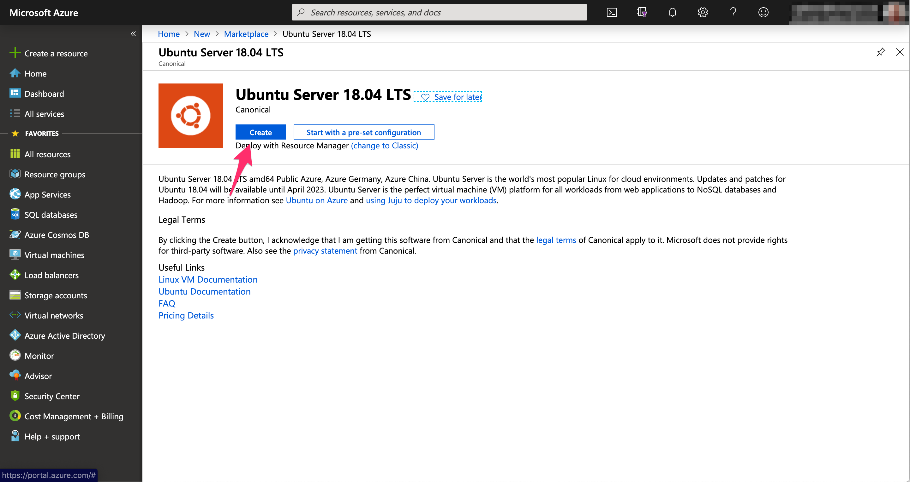
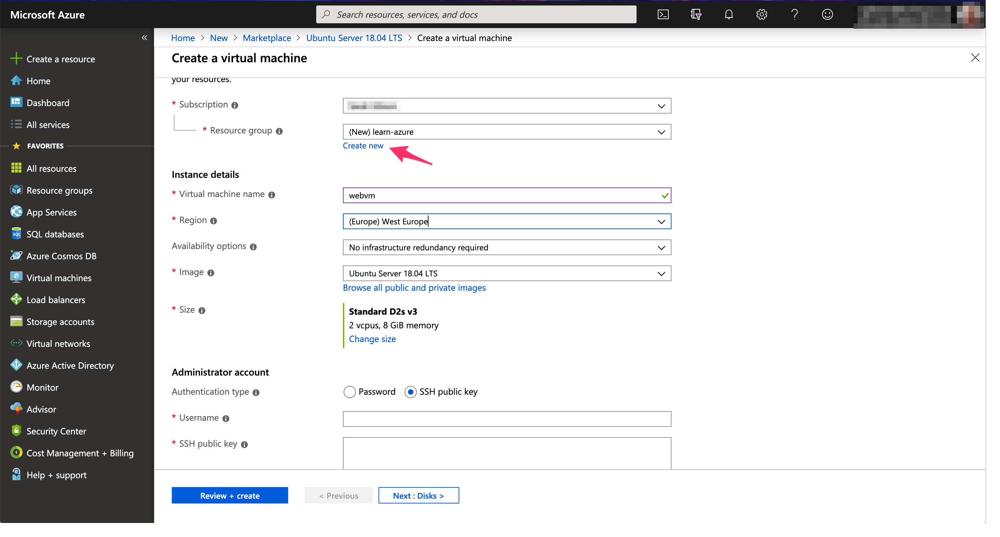
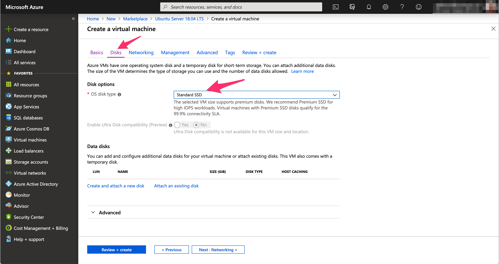
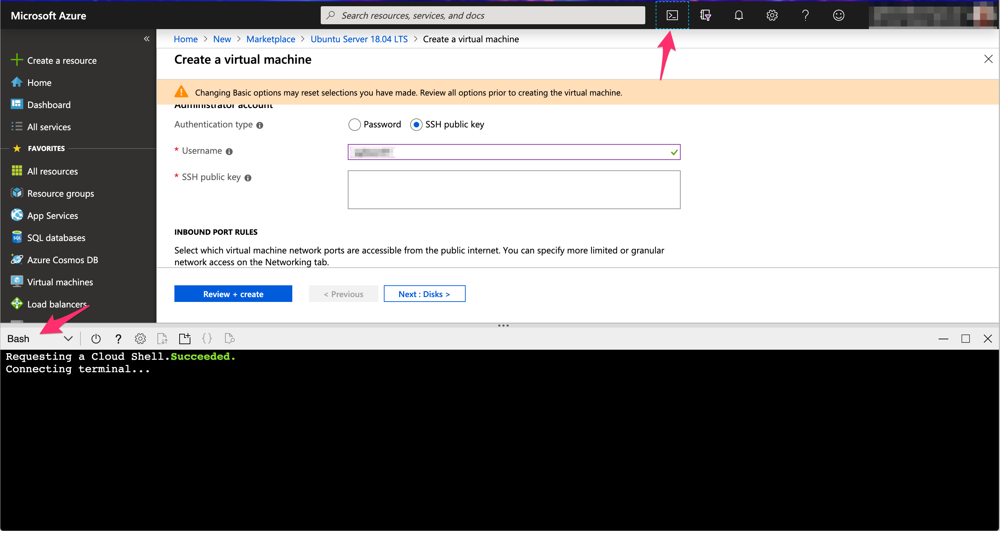
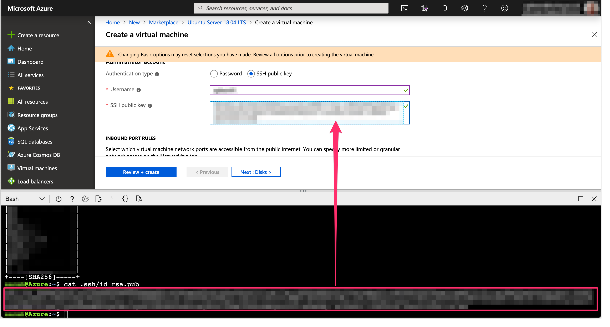
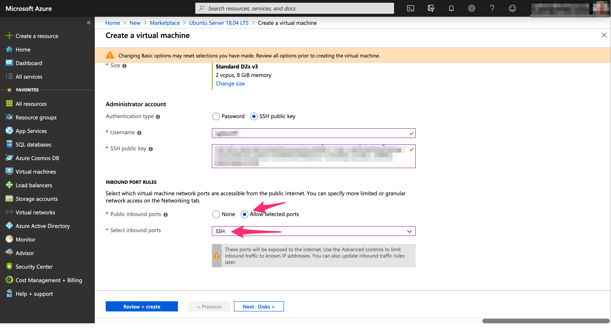

==============
 Introduction
==============

Azure Portal vs Azure Cloud Shell vs Azure CLI
==============================================

* CLI = Command Line Interface

+-------------+----------------------------------------------------------------------------------+-----------------------------------------------+
|             | **Pros**                                                                         | **Cons**                                      |
+=============+==================================================================================+===============================================+
| Portal      | * Works in any web browser                                                       | * Changes regularly as new features are added |
|             | * Does not require any installation                                              | * Not reproducible                            |
|             | * Provides a visual representation of everything                                 |                                               |
+-------------+----------------------------------------------------------------------------------+-----------------------------------------------+
| Cloud Shell | * Provides preinstalled software (e.g. git)                                      | * No access to local files or tools           |
|             | * Compatible with VSCode and a mobile app                                        |                                               |
|             | * Latest version is always available                                             |                                               |
|             | * Persistent storage is attached so you can create/save scripts, templates, etc. |                                               |
+-------------+----------------------------------------------------------------------------------+-----------------------------------------------+
| CLI         | * Access to local files, tools and environments                                  | * Need to keep it updated                     |
|             | * OS agnostic                                                                    |                                               |
+-------------+----------------------------------------------------------------------------------+-----------------------------------------------+

Creating a Virtual Machine
==========================

In the Portal
-------------

1. Login to the Azure Portal at https://portal.azure.com.
   Once logged in, select "Create a Resource" in the upper-left corner of the dashboard.
   Choose "Compute" from the list of resources and then select "See all" next to the "Featured" column.

.. image:: ../figures/01_Intro/portal_vm_step1.png

2. Select "Ubuntu 18.04 LTS" from the list (you may need to search for it).
   This is the most recent version of Ubuntu.
   LTS stands for Long Term Support.
   If there's a newer version of Unbuntu LTS at time of reading, you should select that.
   In the new window, click "Create".

.. image:: ../figures/01_Intro/portal_vm_step2.png

.. image:: ../figures/01_Intro/portal_vm_step7.png

.. image:: ../figures/01_Intro/portal_vm_step10.png

+------------------------------------------------------------------------------------------------------------------------------------+
| **Info:** Secure shell (SSH) key pairs                                                                                             |
|                                                                                                                                    |
| Secure shell is a protocol used to communicate securely with remote computers and it's the most common way to login to a Linux VM. |
| With public-key cryptography, a digital key pair can be used to authenticate you with a remote Linux VM.                           |
|                                                                                                                                    |
| An SSH key pair has two parts: a public key and a private key.                                                                     |
| The public key is stored on the VM in Azure and you keep a copy of the private key.                                                |
| When a login request is made to the VM, the public key on the VM is matched with the private key on the computer trying to login.  |
| If the key pairs match, the requesting computer is authenticated to login to the VM.                                               |
| Public-key cryptography is a great way to verify identity.                                                                         |
+------------------------------------------------------------------------------------------------------------------------------------+
